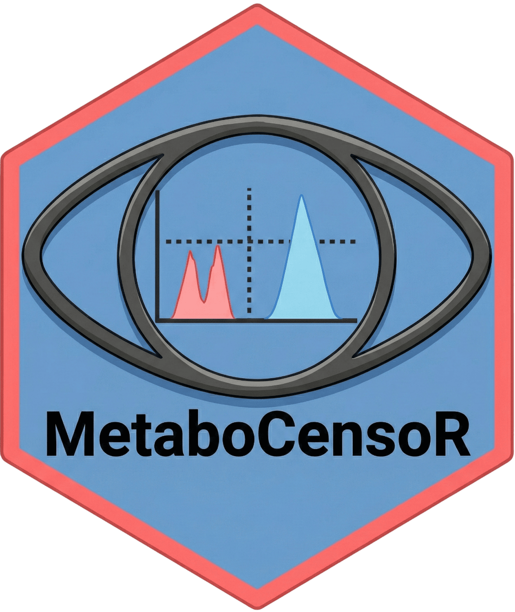

# MetaboCensoR 

### Description :bookmark_tabs:
Shiny App for filtering redundant features in LC-MS peak table and associated .mgf file.

### Contact :mailbox_with_mail:
[⚠️**Issues**⚠️](https://github.com/plyush1993/MetaboCensoR/issues)

  
  
  
  

