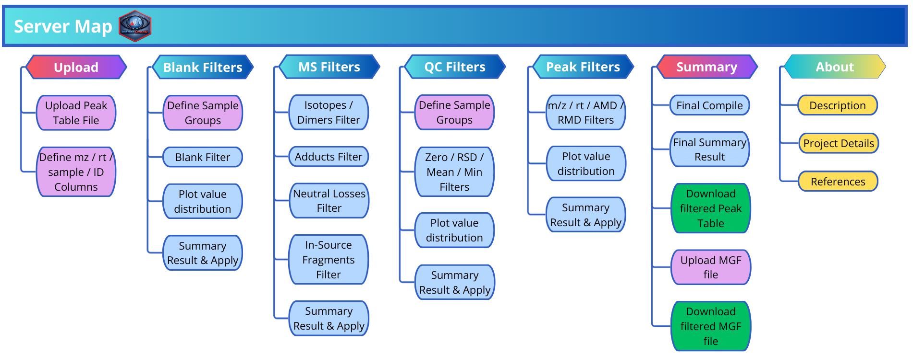

[](https://www.repostatus.org/#active)

[](https://cran.r-project.org/index.html)
[](https://choosealicense.com/licenses/gpl-3.0/)
# MetaboCensoR 

### Description :bookmark_tabs:
The [`R`](https://www.r-project.org/) [`Shiny`](https://www.shinyapps.io/) App for filtering redundant features in LC-MS peak table and .mgf file. 
- Read the output peak table from [`mzMine`](https://mzio.io/mzmine-news/), [`xcms`](https://www.bioconductor.org/packages/release/bioc/html/xcms.html), [`MS-DIAL`](https://systemsomicslab.github.io/compms/msdial/main.html), and `Default format`.<br>
Check compatibility with [`examples of inputs`](https://github.com/plyush1993/MetaboCensoR/tree/main/Input_Examples).
- Filter features detected in a blank with a widget.
- Filter Isotopes/Dimers, Adducts, Neutral Loses, In-Source Fragments, and generate annotation tables.
- Filter features by Zero/RSD/Mean/Min values with a widget.
- Filter peaks by *m/z*, *RT*, RMD, and AMD with a widget.
- Compile the final filtered peak table, and filter [`MGF file`](https://fiehnlab.ucdavis.edu/projects/lipidblast/mgf-files) according to the final peak table.
- Instructions and details.

<details>
  <summary><b>Server Map&nbsp;&nbsp;</b></summary>
  <br/>
</a><a href="DOI:">

</a>
</details><br>

### Launch the App :rocket:
**Shiny Web Deployment**<br>
[**`plyush1993.shinyapps.io/MetaboCensoR`**](https://plyush1993.shinyapps.io/MetaboCensoR/) <br><br>
**Install Locally**<br>

```r
if (!require("BiocManager", quietly = TRUE)) {
    install.packages("BiocManager")
}
if (!require("remotes", quietly = TRUE)) {
    install.packages("remotes")
}
remotes::install_github("plyush1993/MetaboCensoR", INSTALL_opts = "--no-multiarch")
```
or
```r
if (!requireNamespace("pak", quietly = TRUE)) install.packages("pak")
pak::pak("plyush1993/MetaboCensoR")
```
**Run Locally**
```r
MetaboCensoR::run_metabocensor()
```
Alternatively, Windows users can launch the app automatically using a [`.bat`](https://github.com/plyush1993/MetaboCensoR/blob/main/MetaboCensoR.bat) file. After installing R, and MetaboCensoR, edit the batch file so that `REXE` points to your `Rscript.exe.`

<br>

> [!IMPORTANT]
> The App was compiled using [R version 4.5.0](https://cran.r-project.org/bin/windows/base/old/4.5.0/)<br/>
> [`Full App Session Info`](https://github.com/plyush1993/MetaboCensoR/blob/main/session_info.txt)<br/>
> All changes are documented in [`changelog`](https://github.com/plyush1993/MetaboCensoR/blob/main/CHANGELOG.md)
<br>

### Citation :link:
If you use **`MetaboCensoR`** in your study, please cite this paper:

> [To be updated](https://doi.org/)
<br/>

### Contact :mailbox_with_mail:
<div align="left">
<a href="https://github.com/plyush1993/MetaboCensoR/issues"></a>
  <span style="font-weight: bold; vertical-align: middle;"></span>
  <a href="mailto:plyushchenko.ivan@gmail.com"></a>
  <a href="https://github.com/plyush1993"></a>
  <a href="https://orcid.org/0000-0003-3883-4695"></a>
</div>
